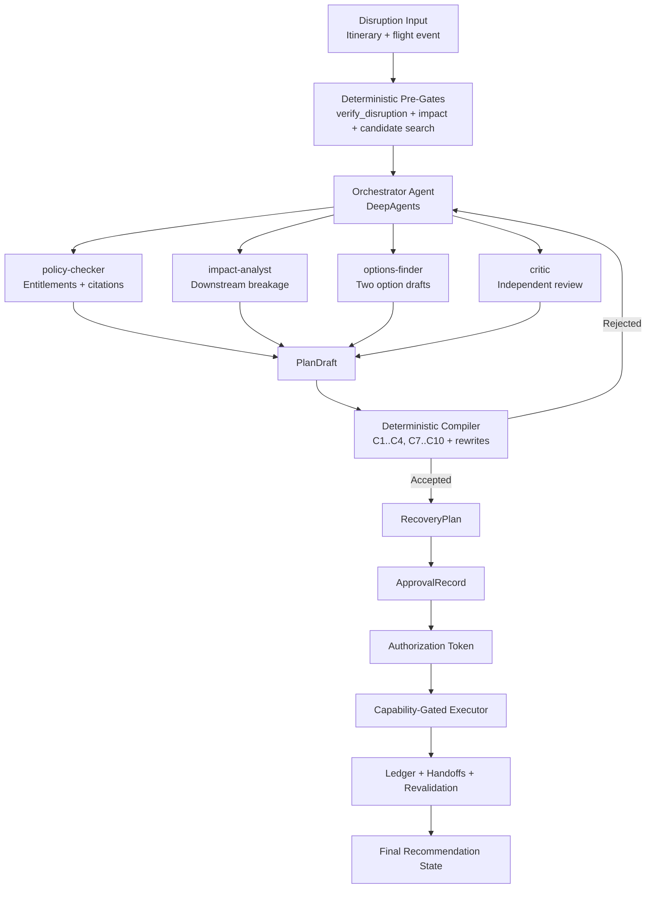
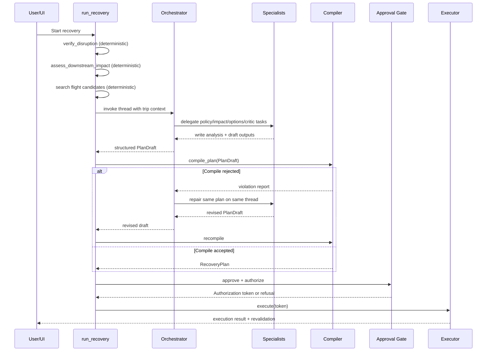

# High-Level Design: TripRecovery Deep-Agent Architecture

## 1. Purpose
This document describes the TripRecovery architecture with focus on:
- Deep-agent setup (hierarchical orchestrator + specialist subagents)
- Architecture pattern (investigate with LLM, commit with deterministic controls)
- Safety boundaries, approval gating, and execution flow

## 2. Scope
In scope:
- Multi-agent decomposition and tool wiring
- Data and control flow from disruption detection to plan recommendation
- Deterministic compile, approval, authorization, and execution path
- Reliability, cost controls, and governance constraints

Out of scope:
- UI design details
- External provider implementation internals
- Full low-level algorithmic details for every validator

## 3. Design Drivers
- The system must generate useful recovery options under uncertain travel disruptions.
- The system must never let model output directly execute high-risk actions.
- Every recommendation must be grounded in retrieved data and policy context.
- Approval must be cryptographically bound to exact plan content.
- Cost and tool use must be measurable and capped per run.

## 4. Architecture Pattern Followed
TripRecovery follows a two-part architecture:

1. Deep-agent investigation layer
- Open-ended reasoning, dynamic delegation, and synthesis.
- Hierarchical orchestrator controlling specialist subagents.

2. Deterministic commitment layer
- No LLM decisions for execution authorization.
- Pure-function compile, approval checks, capability token minting, and execution.

This is the same pattern as the reference "hierarchical multi-agent" setup:
- Tier 1: orchestrator agent
- Tier 2: specialist subagents with isolated loops
- Post-processing synthesis and gate before final recommendation

## 4.1 Advantages and Trade-offs
Advantages:
- Maximum specialization: each subagent is narrow and easier to ground.
- Better reasoning depth for complex disruptions (policy + timing + logistics).
- Stronger safety posture by separating recommendation from execution.
- Better auditability with explicit artifacts, compile checks, and approval records.

Trade-offs:
- Higher LLM spend than a single-agent design.
- More state-management complexity (threading, files, retries, versioning).
- More failure surfaces at orchestration boundaries (delegation, artifact quality).
- Requires strong middleware and tool-governance discipline.

## 5. Logical View

## 6. Deep-Agent Setup (Actual Roles)
### Tier 1: Orchestrator
Responsibilities:
- Coordinates specialist ordering
- Delegates with task tool
- Produces structured PlanDraft output
- Retries on compiler rejection feedback

Configured with:
- Own tool set: flight-status verification tooling only for investigation context
- Response schema enforcement: PlanDraft
- Middleware stack: trip context, cost ceiling, tool budget
- Thread continuity through checkpointer for rejection-retry loops

### Tier 2: Specialist Subagents
1. policy-checker
- Retrieves airline entitlement context and contact information
- Produces analysis/entitlements.md with citations

2. impact-analyst
- Uses dependency graph impact tool
- Produces analysis/impact.md and blocking nodes

3. options-finder
- Reads entitlement and impact artifacts
- Searches replacement flights
- Creates exactly two options in drafts/options.md

4. critic
- Re-validates citations and feasibility independently
- Flags blocking defects before plan compile

5. general-purpose guard (disabled placeholder)
- Intentionally unavailable for recovery work
- Prevents fallback into ungrounded generic reasoning

## 7. Delegation and Shared-State Pattern
TripRecovery uses file-mediated collaboration across isolated agent contexts:
- inputs/itinerary.json
- analysis/entitlements.md
- analysis/impact.md
- drafts/options.md

Important property:
- Subagent contexts are isolated; each task run is independent.
- Shared files are the contract between specialists and orchestrator.

## 8. Runtime Sequence (End-to-End)

## 9. Deterministic Safety Shell
### 9.1 Compile Gate
The compiler transforms and validates model output before anything is actionable.

Core checks:
- C1/C2: exactly two options (A and B)
- C3: unique action IDs
- C4: recommended flight must exist in retrieved candidate set and stated date
- C7: capability class correctness (human-required vs agent-safe)
- C8: outward-facing agent-safe actions require explicit approved message text
- C9: simulate actions and validate itinerary ends in valid state
- C10: citations resolve to policy corpus

Compiler behavior:
- Rewrites canonical facts from provider records (prevents model restatement drift)
- Rejects only where judgment cannot be deterministically reconstructed

### 9.2 Approval Binding and Authorization
- Approval creates an ApprovalRecord tied to plan_version.
- Authorization validates plan hash + itinerary version + trip identity.
- Executor accepts Authorization token only.
- Token cannot be forged through prompts or model output.

### 9.3 Capability Model
- human_required: financial or third-party commitment actions
- agent_safe: internal reversible actions, or pre-approved outward message content

## 10. Tooling and Governance Controls
- Tool denylist per agent to reduce risk and token overhead.
- No execution-capable tools in investigation agent graph.
- Wiring invariants checked at runtime startup.
- Prompt tool reference checks prevent phantom/unbound tool instructions.
- Cost ledger attributes usage per agent and enforces run ceilings.

## 11. Data Contracts
Primary models:
- PlanDraft: orchestrator output contract
- RecoveryPlan: server-owned compiled plan
- ApprovalRecord: human approval binding
- Authorization: execution capability token
- ExecutionResult, LedgerEntry, Handoff, ValidationResult

Versioning and integrity:
- itinerary_version derived from itinerary content hash
- plan_version derived from compiled plan content
- authorization fails closed on mismatch

## 12. Failure Handling and Recovery
- Early stop if disruption verification is insufficient.
- Early stop if no viable replacement candidate set.
- Retry loop on compile rejection with same thread context.
- Refusal reasons for approval/authorization are explicit and user-actionable.
- Revalidation after execution ensures itinerary consistency.

## 13. Mapping to Current Modules
- Orchestration runtime: recovery/agent.py
- Subagent specs and wiring checks: recovery/subagents.py
- Prompts: recovery/prompts.py
- Investigation tools: recovery/tools.py
- Compiler and plan rules: core/plan_compiler.py
- Approval + authorization: core/approval.py
- Capability-gated execution: core/executor.py
- Persistence and recovery state: core/store.py
- Impact and simulation: core/impact.py, core/itinerary_ops.py

## 14. Non-Functional Characteristics
- Safety: deterministic gates and capability-token execution
- Explainability: citation-grounded entitlements and rejection reports
- Reliability: checkpointer-backed retry continuity
- Cost efficiency: per-agent budget and middleware-based tool slimming
- Auditability: persisted plans, approvals, ledger, and handoffs

## 15. Recommended Next Design Steps
1. Add architecture decision records (ADRs) for compile rule evolution and capability class policy.
2. Define service boundaries for production deployment (agent service vs deterministic control service).
3. Add SLOs and operational alerts for verification failures, compile rejection rates, and authorization refusals.
4. Introduce live-provider adapters behind source interfaces with contract tests.
