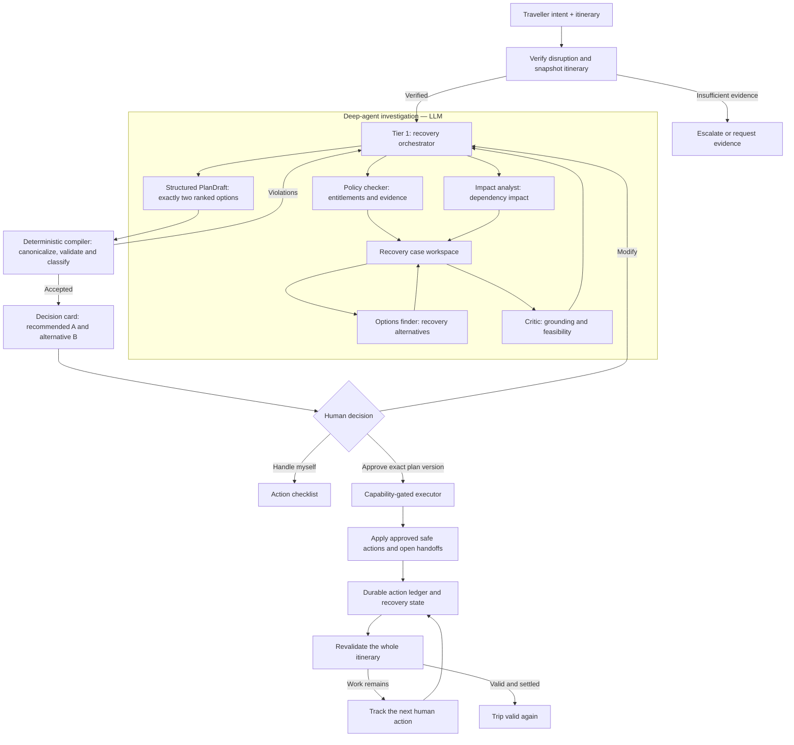

# TripRecovery

Deep-agent trip disruption recovery.

When a flight cancellation is **verified**, TripRecovery finds everything the
disruption affects, creates **two** feasible recovery plans, explains the
trade-offs, executes approved non-financial actions, and tracks the remaining
human actions until the itinerary is valid again.

> **Guiding principle** — the model decides what to investigate next;
> deterministic controls decide what it may execute and whether the trip is valid.

---

## Architecture

The flow is split at approval, because the two halves have opposite requirements.
Investigation is open-ended search and needs a model choosing its own next step.
Commitment must be replayable and must never depend on prompt discipline.


TripRecovery follows one product path: a hierarchical deep agent investigates
and recommends; deterministic controls verify, authorize, execute and revalidate.
The split exists because investigation requires judgement while commitment must
be replayable and must never depend on prompt discipline.




The diagram shows the target high-level design. The current orchestrator uses a
bounded specialist sequence and may re-delegate after a block, critic finding or
compiler rejection. Evolving that sequence into case-state-driven selection of
the next relevant check is an explicit next step, not something hidden behind the
diagram.

### Decision ownership

| LLM owns | Deterministic system owns |
|---|---|
| Selecting the next relevant investigation within the recovery objective | Verifying the disruption and snapshotting itinerary state |
| Interpreting unclear booking and policy conditions | Canonical flight, fare, schedule and provenance facts |
| Constructing two meaningfully different recovery alternatives | Plan schema, identity, coverage and feasibility checks |
| Explaining recommendation trade-offs and risk | Capability classification, version binding and authorization |
| Deciding when insufficient evidence requires escalation | Exact execution, the action ledger and whole-trip revalidation |

### Deep-agent roles and shared state

- **Recovery orchestrator** — plans the investigation, delegates bounded tasks,
  synthesizes specialist findings and returns a typed `PlanDraft`.
- **Policy checker** — retrieves rebooking, accommodation, meal, compensation,
  refund and contact evidence with citations.
- **Impact analyst** — uses the trip dependency graph to find downstream bookings
  that are broken or at risk.
- **Options finder** — searches retrieved inventory and constructs exactly two
  complete recovery alternatives.
- **Critic** — independently rechecks grounding, capability classes and option
  feasibility before compilation.

The specialists have isolated model contexts. They collaborate through a
recovery workspace containing the redacted itinerary, policy evidence, impact
analysis and option drafts. The intended production form is a case-scoped,
versioned `RecoveryCase`; the current prototype uses files under
`workspace/{analysis,drafts}/`.

The agent has **no tool that can change anything** outside its sandboxed
workspace. `recovery/subagents.py:check_tool_wiring()` asserts that on every run,
so the property survives R3 adding an executor.

### What the agent is never trusted with

| Fact | Owner | Why |
|---|---|---|
| Whether the flight is really disrupted | `recovery/agent.py:verify_disruption` | Runs before any tokens are spent, so "stop if verification is insufficient" is a gate, not an instruction |
| The list of impacted bookings | `core/impact.py` | The UI, executor and validator must all read the same numbers |
| Which flights exist | `core/sources.py` | Compiler rule C4 rejects any recommended flight not in the retrieved set |
| `itinerary_version` / `plan_version` | `models.py` | A model that computes its own approval hash can invalidate the gate by restating the plan |

---

## Phase status

- [x] **R0 — Contracts** (`models.py`: plan, actions, approval, ledger, handoff, validation)
- [x] **R1 — First workflow** verify → impact → two typed options → compile, offline gate
- [x] **R2 — Approval binding** `ApprovalRecord`, `Authorization` capability token, five refusal reasons, SQLite persistence
- [x] **R2 — Grounding** policy corpus, lexical retrieval, citation audit, `policy-checker`, `critic`
- [x] **R3 — Executor + ledger** capability-gated executor, idempotent ledger, handoffs
- [x] **R4 — Revalidation** whole-itinerary recheck after each confirmation (same mechanism as R3, so it landed with it)
- [x] **R5 — UI** Streamlit: verified card → impacts → two options → receipt → valid again
- [x] **T0 — `write_todos` phantom** removed; guard added so a prompt cannot name an unbound tool
- [x] **T1 — Cost attribution** per-agent calls/tokens/cache-hit via a shared `CostLedger`
- [x] **T2 — Narrow the draft schema** to what the model decides (`FlightChoice`, no `impacts`)
- [x] **T3 — Per-agent tool budget** — 1,369–1,546 tok/call; ~40% off fixed overhead with T0
- [ ] **T4/T5/T6 — Grounding cache check, critic slimming, ceiling recheck** — need live data first
- [ ] **R6 — Eval** 10 scenarios + adversarial (infeasible flight, mutated hash, restart)

## TODO

- **OPEN — parse a booking-confirmation PDF into an `Itinerary`.** The uploader
  accepts a PDF because that is what a traveller actually has, but nothing reads
  it yet. Uploading one **falls back to the sample trip** and carries on, with a
  single line on the next screen naming the file it could not read — chosen over
  a dead end so a demo keeps moving, and over silence so nobody approves a plan
  for bookings that are not theirs. A JSON path is kept alongside meanwhile.
  tripsure's `tools/itinerary_parser.py` (pypdf + sanitisation) is the obvious
  starting point.
- **Context compiler (C1/C3)** — typed specialist returns capped at 400 tokens,
  with each request compiled from those structures instead of the orchestrator
  accumulating prose. The source protocols now sit cleanly underneath this.
- **T4/T5/T6** — is the stable prompt prefix caching, does the critic earn its
  turns, and is `MAX_LLM_CALLS` right? All three need one live run.
- **A live `Sources` implementation** — real flight status/search, real airline
  contacts. `DATA_MODE=live` raises today rather than falling back.
- `git init` — this directory is not yet a repository.

---

## Setup

```bash
cd tripRecovery
uv venv --python 3.12
uv pip install -e .
cp .env.example .env          # then add OPENAI_API_KEY
```

```bash
# Offline gates — no API key, no spend. Run these before any live run.
.venv/bin/python -m eval.smoke_r1    # core, compiler, agent assembly
.venv/bin/python -m eval.smoke_r2    # approval binding, grounding, citation audit
.venv/bin/python -m eval.smoke_r3    # executor, ledger, handoffs, close-out

# One live run of the real agent.
.venv/bin/python -m eval.smoke_r1 --live

# Offline fixture UI — useful for deterministic-flow testing, not an agent run.
.venv/bin/streamlit run streamlit_app.py
```

### Demo controls (`.env`)

| Var | Purpose |
|---|---|
| `FROZEN_CLOCK` | ISO-8601 with offset. Without it, scenario dates drift from "today" and every latest-permissible-change calculation changes answer between runs. |
| `FAIL_MODE` | `none \| http_500 \| timeout \| stale` — inject provider failure to exercise the uncertainty path. `stale` is the nastiest: complete-looking data that is simply out of date. |
| `MAX_COST_USD` / `MAX_LLM_CALLS` | Hard ceilings on the whole run, every agent counted. Breaching either raises `RuntimeError` mid-run rather than logging a warning nobody reads, and the message says which agent spent what. |

---

## The two-option contract

Every option carries all of: replacement flight with `source` and `fetched_at`,
total additional cost, arrival delay in minutes, the impacts it resolves, every
required action with a capability class, and a risk level with a stated reason.

`core/plan_compiler.py` works against **recomputed** facts, never against the
draft's claims about itself, and it does two different things.

**It rewrites what it can compute.** Everything provenance-bearing on a
recommended flight — carrier, departure, arrival, price, stops, source — is
replaced from the provider record. The arrival delay is derived from it. A
hedging phrase is appended when the data is uncertain. The model chooses *which*
flight; it does not get to restate what that flight is, so a misquoted fare
cannot reach a traveller.

**It rejects what it cannot.**

```
C1  exactly two options                  C7  capability classes are correct
C2  option ids are exactly A and B       C8  outward-facing actions carry approved text
C3  action ids unique                    C9  performing the actions leaves a VALID trip
C4  the flight was retrieved, on that day  C10 every citation resolves to a real chunk
```

C9 is the strongest of these and is proven by **simulation**: the option's actions
are applied via `core/itinerary_ops.py` — the same code the executor runs — and the
result is put through the same validator that closes the case. So "both options
resolve every identified impact" stops being a claim to check and becomes a thing
to do. It started as "every broken booking has an action targeting it", which
accepted an action that named the right booking and moved it to a useless time.

There is no C5 or C6 — both started as rejections and became rewrites, on the
principle that **a check the model can fail should only exist where there is a
judgement we cannot make ourselves.** What survives is identity (C1–C4, C10) and
judgement (C7–C9): which flight, what grounds it, who may act, and whether the
trip is actually recovered. Both removals came out of live runs; see the module
docstring.

Rejection returns a report fed back as a new turn on the same `thread_id`, so the
agent keeps its messages, files and todos rather than rebuilding from criticism
alone. That requires a checkpointer, which `run_recovery` now installs
unconditionally — without one the retry starts cold and regresses.

## Capability classes

The safety axis is **not** financial vs non-financial. Messaging a hotel costs
nothing and cannot be unsent.

- **`human_required`** — money moves, or a third party must confirm.
  `pay_for_flight` and `rebook_transfer` are always human-required.
- **`agent_safe`** — internal and reversible (`update_itinerary`,
  `update_calendar`), **or** outward-facing with its exact text approved in
  advance. `send_hotel_message` is agent-safe only when `message_body` is
  supplied — and that text is hashed into `plan_version`, so the approved bytes
  are the sent bytes.

## Approval binding

The R1 plan said this phase would use deepagents' `interrupt_on`. It doesn't, and
the reason matters: `interrupt_on` pauses **a tool call the model makes**. Here the
executor is not a tool, so there is no call to interrupt. Guarding a door the model
cannot walk through would look like a control while protecting nothing.

What replaces it is a capability token:

```python
approval = approve(plan, "A", approved_by="alex")   # ApprovalRecord | Refusal
auth     = authorize(plan, approval, itinerary)     # Authorization  | Refusal
execute(auth)                                        # R3 — takes nothing else
```

`Authorization` can only be minted by `authorize()` — constructing one directly
raises `PermissionError` — and it carries the agent/human action split so the
executor never re-derives the capability rules and so can never disagree with what
was approved. No prompt to bypass, no config key to typo.

Five independent refusals, because they fail for different reasons and a single
"invalid" would tell the traveller nothing about what to do next:

| Reason | Means |
|---|---|
| `PLAN_TAMPERED` | Plan content no longer hashes to the version it claims — most usefully caught after loading it back from storage |
| `APPROVAL_STALE` | The approval names a different `plan_version`; the plan changed after approval, so it needs re-approving |
| `ITINERARY_CHANGED` | The trip moved underneath the plan; its actions were computed against a schedule that no longer exists |
| `UNKNOWN_OPTION` | The approved option isn't in the plan |
| `TRIP_MISMATCH` | The approval belongs to a different trip |

Plans are persisted alongside approvals precisely because approval binds to a hash,
and a hash is only useful if its content can be produced again. Without the stored
plan, a restart between "traveller approves" and "actions run" fails closed but
uninformatively.

## Token budget

Measured per model call, from captured `ModelRequest`s rather than estimates:

| Agent | before | after | saved | typical calls | **saved/run** |
|---|---|---|---|---|---|
| orchestrator | 6,677 | 4,940 | 1,737 | 6 | 10,422 |
| policy-checker | 3,080 | 1,711 | 1,369 | 4 | 5,476 |
| impact-analyst | 2,763 | 1,394 | 1,369 | 2 | 2,738 |
| options-finder | 3,911 | 2,542 | 1,369 | 5 | 6,845 |
| critic | 3,438 | 1,892 | 1,546 | 3 | 4,638 |

**87,777 → 52,718 fixed tokens per run, a 40% reduction** (T0 + T2 + T3, on a
20-call model). `response_format` rides **every** orchestrator call, not just the
last — worth knowing before adding a field to `PlanDraft`.

### T3 — the tool budget did most of the work

deepagents' `FilesystemMiddleware` binds all seven filesystem tools to every
agent: `grep` 555, `read_file` 440, `glob` 411, `edit_file` 257, `write_file`
177, `delete` 146, `ls` 111 — 2,097 tokens on every call. Measured, nothing here
searches the workspace, patches a file in place, or deletes anything. The
orchestrator went from advertising 9 tools at 2,802 tokens to 4 at 1,256.

`ToolBudgetMiddleware` is a **denylist, not an allowlist**, and that direction is
load-bearing: an allowlist would silently drop a tool it had not heard of —
including the structured-output shim a provider without native `response_format`
would bind — and the failure would look like the model's fault. Tested by
asserting an unfamiliar tool survives.

The critic is denied `write_file` on top: a critic that can write can quietly fix
what it was asked to judge.

### T2 — smaller than projected, still worth it

I estimated ~480 tokens off the draft schema and got **191** (1,470 → 1,279).
Pydantic's per-field JSON-schema overhead dominates, so a 3-field `FlightChoice`
is not much cheaper than the 13-field `FlightRef` it replaced — and my first
version, with a full `description` on each field, actually cost *more* than the
model it replaced. Descriptions are now reserved for the one thing a model cannot
infer from the data it is copying (`departure_date`'s format).

The correctness half of the argument was always the stronger one and it holds.
`FlightChoice` carries the designator and the departure **date** and nothing
else, so both R1 live failures — SQ425 with a departure of 16:10 instead of
16:30, and AI2380 given SQ421's departure time — are now *unrepresentable* rather
than corrected after the fact. `PlanDraft.impacts` is gone too: the compiler
discarded it on every run in favour of the graph's own list, so it cost schema
tokens and output tokens to produce something thrown away.

### The `write_todos` phantom (fixed)

For four phases the orchestrator prompt opened with "Call `write_todos` first".
That tool comes from langchain's `TodoListMiddleware`, which deepagents does not
install by default — so it was **never bound**. Every run burned an orchestrator
turn (~6,700 tokens) on it, and strict providers rejected the call outright
(Groq: `400 attempted to call tool 'write_todos' which was not in
request.tools`), which I had wrongly filed as Groq being fussy. The model was
doing exactly as instructed.

Installing the middleware was the alternative and was the wrong call: `write_todos`
costs 982 tokens of schema on every call, and this workflow is not discovered —
it is prescribed in the prompt and enforced by the compiler. A todo list
restating a fixed sequence is ceremony.

`check_prompt_tool_references()` now fails if any prompt backtick-names something
that is not a bound tool, a model field, an enum value or a subagent. The
vocabulary is derived from the code, so new fields need no maintenance; only tool
argument and result keys are declared, and there are three.

### Cost attribution

`CostLedger` is shared by one `CostCeilingMiddleware` per agent. The ledger has to
be shared (one budget per run — five independent ceilings would each pass while
the run blew past all of them) and the recorders have to be separate (a single
instance across five agents can only report a total, which says nothing about
where the tokens went).

It records `cache_read` from LangChain's normalised shape *and*
`prompt_tokens_details.cached_tokens` from OpenAI's raw one — a provider
reporting the raw dict would otherwise look like a 0% cache hit. That number
decides whether splitting the grounding out of the prompt is worth doing at all:
deepagents' `append_prompt_caching_middleware` wires Anthropic/Bedrock/Fireworks
and **nothing for OpenAI**, but OpenAI caches >1024-token prefixes automatically.
If our 2.2k stable prefix is already cached, trimming safety text would pay a real
price for an imaginary saving.

## Product planning path

The product architecture has one planning path: the deep-agent orchestrator and
its four specialists. Only a `PlanDraft` produced through that investigation is
evidence that the agentic workflow ran.

`core/planner.py` remains an offline fixture and test utility. It is useful for
exercising the compiler, approval, executor and UI without spending model tokens,
but it is not a second product architecture and is intentionally excluded from
the HLD. The current Streamlit fallback to this fixture is a demo limitation; the
evaluation path should require the deep agent and surface an explicit failure if
it cannot run rather than silently substituting the fixture.

## The UI

`streamlit run streamlit_app.py` — five states in one linear flow: verified
disruption → what is affected → two options → action receipt → trip is valid
again.

**The UI holds no copy of the truth.** Which state to render is derived from the
SQLite store on every rerun — the approval row, the handoff rows, the working
itinerary. `st.session_state` holds only what is purely about the browser tab.
That is not style: the recovery outlives the page, since a traveller may confirm
the transfer today and the payment tomorrow from a different tab. Any state the UI
kept for itself would be a second, staler answer to "where is this trip up to".

For offline development, the UI can render a hand-authored fixture from
`demo.py`. That fixture goes through the real `compile_plan`, so it remains useful
for testing the deterministic half of the system, but it does not demonstrate
the deep-agent planning path. `eval/harness.py` re-exports the same fixture so the
offline UI and compiler gates cannot drift apart.

Two panels from the mockups are real rather than decorative:

- **Modify the plan** changes a booking's time and recompiles. Watch the
  `plan_version` change — a modified plan is a different plan, so an approval
  against the old one stops being valid. An impossible time is rejected with the
  compiler's own violation text.
- **Handle it myself** takes no action and sends nothing, and lists what needs
  doing with the times that make the trip work.

Once approved there is deliberately no route back to the options. A message to the
hotel cannot be unsent, so "Start over" is the honest escape hatch rather than an
edit affordance.

## Executing, and closing the case

`execute()` takes an `Authorization` and nothing else. Three properties, each
tested by effect rather than assertion:

**Idempotent.** The ledger's primary key is `(trip_id, plan_version, action_id)`
and the insert is checked *before* the side effect, so a UI retry or a resumed
session cannot send a second message to the hotel.

**Order-independent.** Every action writes absolute times to a distinct booking,
so handoffs confirmed in any order land on the same itinerary — which matters
because nobody controls the order a traveller gets round to them.

**Non-closing.** Executing the agent half does not end the recovery (G11). The
case closes only when `revalidate()` finds the whole itinerary consistent **and**
no handoff outstanding.

The test that keeps this honest is `outbox()` staying empty. Asserting that
`authorize()` returned a `Refusal` only proves it returned a `Refusal`; an empty
outbox proves nothing went out.

### The hole R3 and R5 exposed in edge inference

Chronological edges miss one fact, and it only shows up once times start moving.
Two instances, both found by testing rather than by reading:

- Move the flight 16:15 → 23:15 and leave the airport transfer at 17:00. Re-sorting
  puts the transfer *before* the arrival — a comfortably positive gap, no reported
  problem, and a car that turns up six hours before the plane.
- Move the Night Safari to the 14th. The trip lands on the 15th, so it is simply
  impossible; chronologically it sorts first, every gap after it is enormous, and
  the itinerary "validates".

Both are the same missing dependency: a booking at location X depends on the flight
that brings the traveller to X. `_presence_edges` makes it explicit — *you cannot
be somewhere before you have arrived there* — which is what lets close-out refuse
to close, and what lets the modify panel reject a time that would strand someone.

Matching is by `location_iata`, so a booking without one contributes no edge. That
is the honest limit: real coverage needs the destination resolved from a place
name, which is a geocoding problem rather than a graph one.

## Data sources

Everything the system cannot compute for itself arrives through one of three
protocols in [core/sources.py](core/sources.py) — `FlightSource`,
`ContactSource`, `PolicySource` — bundled into a `Sources` set selected by
`DATA_MODE`.

Before this, "mock" was a fallback baked into four separate modules:
`core.providers` read `data/mock_flights.json` directly, `core.citations` opened
`data/airline_contacts.json` at import time, `core.policy` had the corpus path as
a module constant. Everything worked — but mock was not *one implementation among
several*, it was the only one, wired in at four places. Adding a live provider
meant editing business logic rather than choosing a source.

Two things fall out of the boundary being explicit:

- A live source can be written and selected without touching the planner, the
  compiler, the entitlement builder or the agent's tools.
- **Tests can inject a source per case.** The uncertainty path used to be
  reachable only by setting `FAIL_MODE` for the whole process; now one test hands
  over `MockFlightSource(fail_mode="stale")` and leaves everything else alone.
  `Sources` is a frozen dataclass, so `dataclasses.replace(src, policy=...)`
  swaps one source and leaves the other two intact.

`DATA_MODE=live` **raises** rather than falling back to fixtures. A silent
fallback is exactly how a demo gets mistaken for a deployment.

`core/policy.py` is now pure parsing and scoring — it knows how to chunk markdown
and score a chunk against a query, and nothing about where the corpus lives. A
dense-retrieval backend can reuse the scoring without inheriting a fixture path.

## Grounding

Corpus in [policies/](policies/) as `## <domain>:<id>` chunks; hard invariants in
[grounding/invariants.md](grounding/invariants.md), inlined verbatim into the
orchestrator prompt and deliberately unretrievable.

**G6 and G7 are substantively rewritten from tripsure's and must not be copied
back.** tripsure recovers flights and touches nothing else; this product executes
approved changes to hotel, activity and calendar bookings. An invariant still
saying "ancillary bookings are not modified" would contradict the product it is
meant to constrain.

**Retrieval is lexical (IDF over unigrams), not embedded — a choice, not a
stopgap.** Embedding would put the offline gate behind a credential and a bill,
making every citation-audit rule untestable without one. The corpus is a few dozen
short, densely-labelled chunks whose discriminating terms are literal, so IDF
handles them at least as well and never returns a plausible-but-unrelated
neighbour. It is also deterministic, so retrieval replays. The upgrade is a swap
behind `retrieve_policy_context`, with `source` telling callers which backend
answered.

The audit in [core/citations.py](core/citations.py) exists for one failure in
particular: **a citation that is real, resolvable, and wrong** — quoting the £520
EC 261 figure from a *delay* rule to justify compensation on a *cancellation*. The
citation resolves, so it reads as rigorous. Five checks of increasing strength:
resolvability, figure containment per section, phone containment against the
contact fixture, kind matching, and category completeness.

Two exemptions were earned against live output and are tested in both directions: a
fare carrying `source`/`fetched_at` needs no citation, but that exemption does not
apply in a compensation context, or "you are owed £520 [source: …]" would launder a
policy claim as tool data.

---

## Layout

```
tripRecovery/
├── config.py                 # env, ceilings, buffer thresholds
├── models.py                 # R0 contracts — model-facing vs server-owned
├── core/                     # deterministic. no LLM, no prompts, pure functions
│   ├── sources.py            # FlightSource / ContactSource / PolicySource + mocks
│   ├── clock.py              # FROZEN_CLOCK
│   ├── dependency_graph.py   # bookings → nodes + must-precede-by-N edges
│   ├── impact.py             # downstream breakage, replacement feasibility, validation
│   ├── policy.py             # corpus parsing + lexical scoring (no paths)
│   ├── citations.py          # the citation audit
│   ├── entitlements.py       # six-category entitlement picture + advice
│   ├── planner.py            # offline fixture/test builder; not a product path
│   ├── plan_compiler.py      # THE GATE — C1-C4, C7-C10 + canonicalisation
│   ├── itinerary_ops.py      # apply actions — used by BOTH compiler and executor
│   ├── approval.py           # approve() / authorize() / Authorization token
│   ├── executor.py           # execute() / confirm_handoff() / revalidate()
│   └── store.py              # SQLite: plans, approvals, ledger, handoffs, working itinerary
├── recovery/                 # the deep agent. investigation only
│   ├── llm.py                # "<provider>:<model>" spec factory
│   ├── tools.py              # LLM-safe wrappers + explicit tool loadouts
│   ├── prompts.py            # orchestrator system prompt + grounding preamble
│   ├── subagents.py          # 4 specialists + general-purpose guard + wiring check
│   ├── middleware.py         # trip context on every call; hard spend ceiling
│   └── agent.py              # run_recovery(): verify → investigate → compile
├── streamlit_app.py          # the UI — state derived from the store, not session
├── demo.py                   # the demo scenario; eval/harness.py re-exports it
├── policies/                 # retrievable corpus (## domain:id chunks)
├── grounding/invariants.md   # G1-G11, inlined into the prompt, never retrieved
├── data/                     # sample itinerary, flight fixtures, contact fixture
├── workspace/                # the agent's sandboxed virtual filesystem
└── eval/
    ├── harness.py            # check harness; re-exports demo.py's fixtures
    ├── smoke_r1.py           # offline gate + --live
    ├── smoke_r2.py           # approval binding + grounding
    └── smoke_r3.py           # executor, ledger, handoffs, close-out
```

## Related

Grew out of [tripsure](../tripsure/), which holds the deterministic-LangGraph
build of the same use case and a working deep-agent advisor. `core/dependency_graph.py`
and `core/impact.py` are ported from its `tools/` — the buffer policy is proven
against its eval scenarios and was not worth re-deriving. Middleware shape is
adapted from
[3E-Code-Review-Agent](https://github.com/The-Gen-Academy/3E-Code-Review-Agent/tree/main/Deep%20Agents%20Version).
